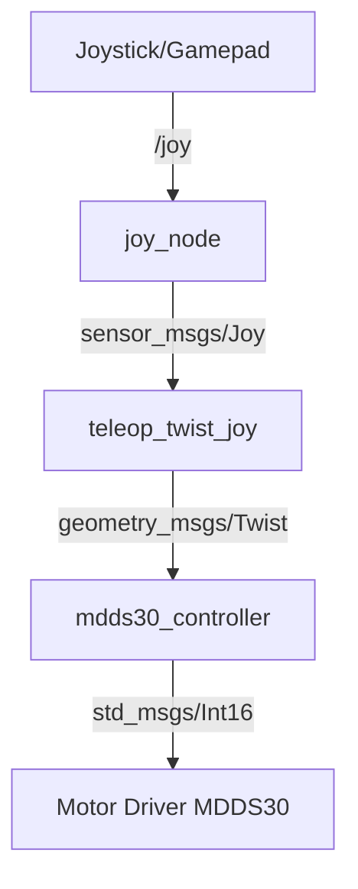

# MDDS30 ROS 2 Controller

A ROS 2 package for controlling the [Cytron MDDS30 Dual Channel 30A Motor Driver](https://www.cytron.io/p-mdds30) via serial communication.  
This is a port of the [original ROS 1 package by r1b4z01d](https://github.com/r1b4z01d/MDDS30-ROS-Controller) to ROS 2.

---

## Features

- Control left and right motors independently via ROS 2 topics.
- Integrate with joystick or gamepad using `joy` and `teleop_twist_joy`.
- Launch-ready configuration for quick setup.
- Tested on ROS 2 **Kilted Kaiju** (adapt to your distribution as needed).

---

## ROS 2 Node / Topic Flow



- /joy → Raw joystick data.
- /cmd_vel → Velocity commands from teleop_twist_joy.
- /mdds30_controller/motor_left & /mdds30_controller/motor_right → Direct motor speed control topics.

⸻

## Installation

### Clone the Repository

```bash
cd ~/ros2_ws/src
git clone https://github.com/iot-forge/mdds30_ros2_controller.git
```
### Install Dependencies

```bash
sudo apt install ros-kilted-joy ros-kilted-teleop-twist-joy joystick
```
### Add User to dialout Group

```bash
sudo usermod -a -G dialout $USER
# Log out and back in for changes to take effect
```

## Build

From your workspace root:
```bash
colcon build --symlink-install
source install/setup.bash
```

## Usage

### Source the Setup File

```bash
source ~/ros2_ws/src/mdds30_ros2_controller/install/setup.bash
```

### Launch the Controller

```bash
ros2 launch mdds30_ros2_controller mdds30_controller.launch.py
```

## Direct Motor Control

```bash
ros2 topic pub -1 /mdds30_controller/motor_right std_msgs/msg/Int16 '{data: 50}'
ros2 topic pub -1 /mdds30_controller/motor_left  std_msgs/msg/Int16 '{data: 50}'
```
Speed range: -100 (full reverse) to 100 (full forward).


## Joystick / Gamepad Control

### Start Joystick Node

```bash
ros2 run joy joy_node
```
### Verify Joystick Messages

```bash
ros2 topic echo /joy
```

### Teleoperation with Twist Messages

```bash
ros2 run teleop_twist_joy teleop_node --ros-args --params-file ~/ros2_ws/src/mdds30_ros2_controller/config/teleop.yaml
```

## Ubuntu 24.04 (Noble Numbat) UART Configuration on Raspberry Pi

If you are running this package on a Raspberry Pi using Ubuntu 24.04, you may need to enable and configure UART.

1. Understand the UART Options
	•	PL011 full UART → Better performance, no baud rate drift
	•	miniUART → Baud rate tied to CPU clock, may drift

On Raspberry Pi 4/5, by default:
	•	/dev/ttyAMA0 → PL011
	•	/dev/ttyS0 → miniUART

2. Check Current UART Devices

```bash
ls -l /dev/serial*
ls -l /dev/ttyAMA0 /dev/ttyS0
dmesg | grep tty
```
3. Edit Boot Configuration

```bash
sudo nano /boot/firmware/config.txt
```

Add:

```
enable_uart=1
dtoverlay=disable-bt
```
4. Disable Serial Console (Optional)

```bash
sudo systemctl disable serial-getty@ttyAMA0.service
sudo systemctl stop serial-getty@ttyAMA0.service
```

Edit /boot/firmware/cmdline.txt and remove:

```
console=serial0,115200
console=ttyAMA0,115200
```

5. Reboot

```bash
sudo reboot
```

6. Test UART

```bash
sudo apt install minicom
minicom -b 115200 -o -D /dev/ttyAMA0
```

Connect TX → RX for loopback and check echo.

7. Notes for Raspberry Pi 5
	•	dtoverlay=disable-bt still works.
	•	For GPIO14/15, no extra overlay needed besides enable_uart=1.
	•	For other pins, use overlays like:

dtoverlay=uart2

This gives /dev/ttyAMA1, /dev/ttyAMA2, etc.


## License

This project inherits the license of the original ROS 1 package. See [LICENSE](LICENSE) for details.

## Acknowledgements
- Original ROS 1 implementation by r1b4z01d
- Cytron Technologies for the MDDS30 motor driver hardware.

